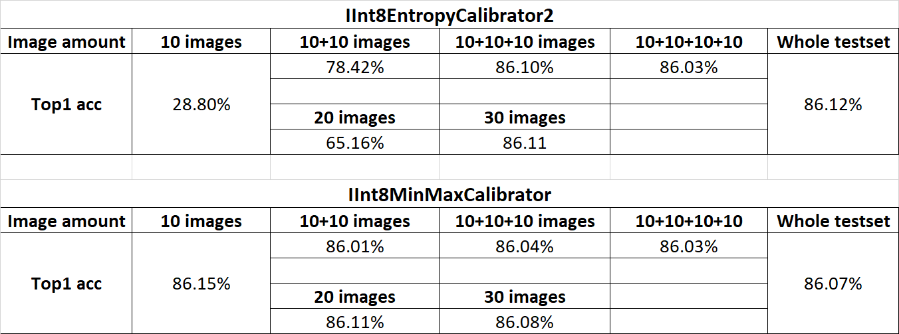

# Quantization Demo with cifar10

This demo is to show how to build a TensorRT INT8 engine for cifar10 classification task. 
It also demonstrates that how the calibration dataset size influences the final accuracy after quantization.


To demonstrate how the calibration dataset size influences the accuracy after int8 quantization


### Run it step by step


1. start a NGC TensorRT container: `docker run -it --gpus all nvcr.io/nvidia/tensorrt:21.03-py3 /bin/bash`

2. (following steps inside container) clone github repo and prepare dataset

```bash
git clone https://github.com/chrjxj/tensorrt_experiments.git

cd tensorrt_experiments/quantization_demo_cifar10

pip install -r requirements.txt

sh download_files.sh
```


3. start

```bash
python sample.py --onnx_model resnet18.onnx --calib_folder cifar10_dataset/calib_dataset_40/ -t cifar10_dataset/test_batch -b 32
```
    
4. If you want to use the whole test dataset to do the calibration. You can use `convert_to_images.py` to convert the cifar10 `test_batch` file into jpeg images. 


5. Select different calibration folder in `cifar10_dataset` to see the inference caused by calibration dataset size and calibration batch size.


6. change the condition in line 64~68 of sample.py to fallback some layers into higher precision.


### Evaluate Results

* Before quantization, the original top-1 accruacy on test_batch is 87.81%. 

* After quantization, the top-1 accuracy is shown as below.



'10+10' images means that we add another 10 images into the existed '10' images. And '10+10+10' means we add another 10 images into the existed '10+10' images. 

'20' and '30' images means the calibration image set was selected randomly.

To evaluate the quality of calibration set. I adopt my another repo [calib-dataset-eval](https://github.com/shiyongming/calib-dataset-eval) 
to calculate and analysis the distribtion of the calibration dataset.


### Reference and credit

* this folder is forked from [TensorRT_quantization_demo_cifar10](https://github.com/shiyongming/TensorRT_quantization_demo_cifar10) prepared by [shiyongming](https://github.com/shiyongming)
* TensorRT python sample: [int8_caffe_mnist](https://github.com/NVIDIA/TensorRT/tree/master/samples/python/int8_caffe_mnist)
